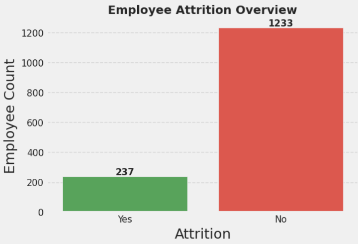
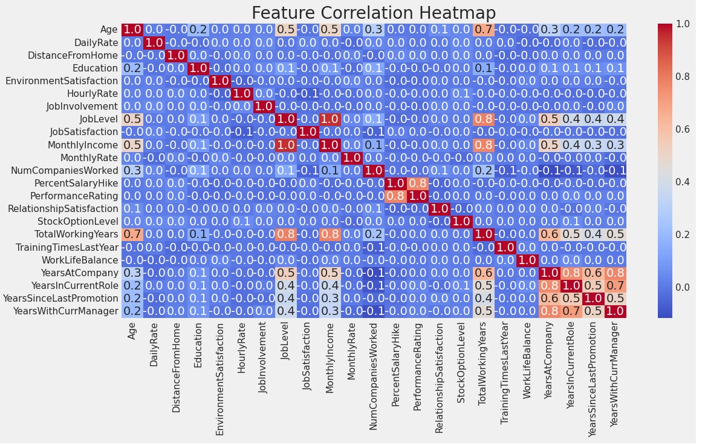
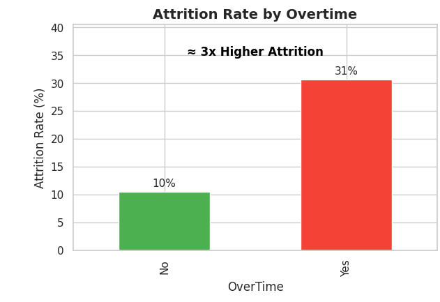

#  Employee Attrition Analysis (EDA Project)

An Exploratory Data Analysis (EDA) project focused on understanding employee attrition patterns using Python visualization and data analysis libraries.

This project analyzes employee demographics, salary, overtime, job satisfaction, and departmental trends to identify the major reasons behind employee turnover.

---

##  Problem Statement

Employee attrition is one of the major challenges faced by organizations. High attrition can lead to:
- Increased recruitment costs
- Loss of experienced employees
- Reduced productivity
- Lower employee morale

This project aims to analyze HR data and uncover insights that can help organizations improve employee retention strategies.

## 📸 Screenshots

### Attrition Distribution

### Correlation Heatmap

### Overtime vs Attrition

